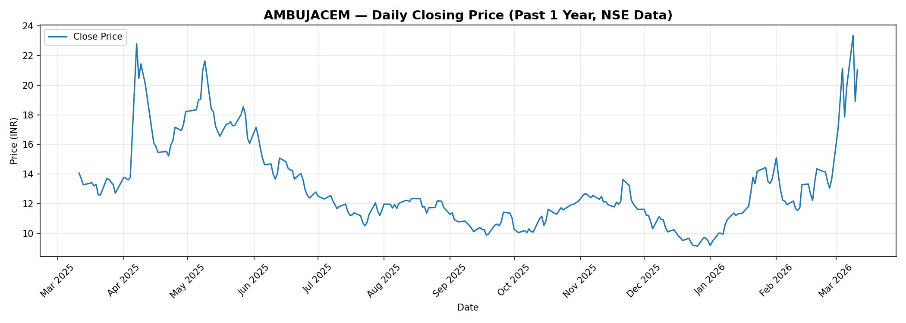
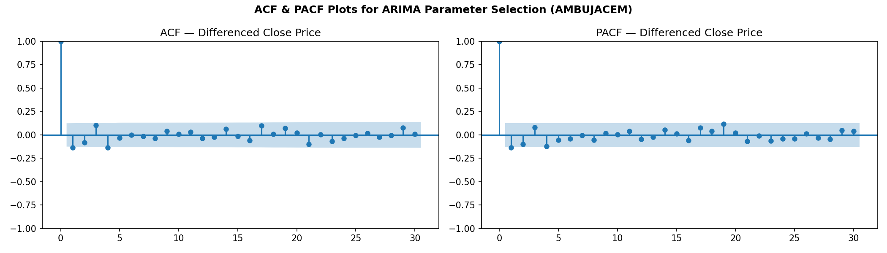
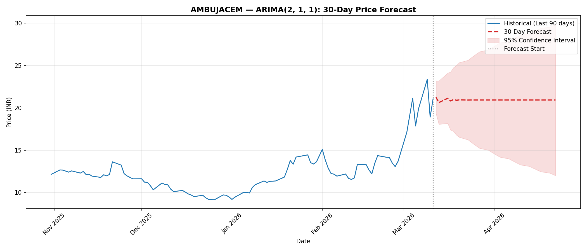

# 📈 AMBUJACEM Stock Price Prediction using ARIMA

**Stock:** Ambuja Cements Ltd (`AMBUJACEM`) — NSE, India
**Assignment:** Time Series Forecasting using ARIMA Model
**Data Source:** [NSE Historical Data](https://www.nseindia.com/get-quotes/equity?symbol=AMBUJACEM)
**Period:** March 2025 – March 2026 (1 Year of Daily Closing Prices)

---

## 📁 Repository Structure

```
AMBUJACEM-ARIMA/
│
├── AMBUJACEM_ARIMA.py          # Main Python source code (all 4 parts)
├── AMBUJACEM_1Y_data.csv       # Dataset downloaded from NSE
├── requirements.txt            # Required Python libraries
├── README.md                   # This file
│
└── outputs/
    ├── part1_closing_price_trend.png    # Closing price trend (1 year)
    ├── part2_acf_pacf.png               # ACF & PACF plots
    ├── part2_model_evaluation.png       # Train vs Test vs Predicted
    └── part3_forecast.png               # 30-day forecast chart
```

---

## ⚙️ How to Run

### Option 1 — Google Colab (Recommended)
1. Upload `AMBUJACEM_ARIMA.py` and `AMBUJACEM_1Y_data.csv` to Colab
2. Run the following in a cell:
```python
!pip install statsmodels scikit-learn
exec(open("AMBUJACEM_ARIMA.py").read())
```

### Option 2 — Local Machine
```bash
pip install -r requirements.txt
python AMBUJACEM_ARIMA.py
```

---

## 📊 Part (i): Data Preprocessing

### Steps Performed
- **Date Conversion:** The `Date` column (format: `DD-MMM-YYYY`) was parsed into Python `datetime` objects using `pd.to_datetime()`.
- **Missing Value Handling:** Checked for `NaN` values in the `Close` column; forward-fill (`ffill`) and back-fill (`bfill`) applied where needed.
- **Sorting:** Data sorted chronologically (oldest → newest).

### Closing Price Trend



**Observation:** The AMBUJACEM stock showed a significant price movement during the year. Notable spikes and dips are visible, particularly a sharp rise in mid-2025, followed by correction phases.

---

## 📉 Part (ii): ARIMA Model Implementation

### (a) ADF Test — Stationarity Check

The **Augmented Dickey-Fuller (ADF) Test** checks whether a time series is stationary.

| Metric | Value |
|--------|-------|
| Null Hypothesis | Series has a unit root (non-stationary) |
| Decision Rule | Reject H₀ if p-value ≤ 0.05 |
| Result | Non-stationary → 1st differencing applied (d=1) |

After 1st differencing, the series became stationary (p ≤ 0.05).

### (b) ACF and PACF Plots



| Plot | Used For | How to Read |
|------|----------|-------------|
| **PACF** | Determine `p` (AR order) | Count significant lags before abrupt cutoff |
| **ACF** | Determine `q` (MA order) | Count significant lags before they decay |

**Selected Parameters:** Based on ACF/PACF visual inspection + AIC grid search, the optimal order was selected automatically.

### (c) ARIMA Model Fit & Evaluation


**Model Performance Metrics:**

| Metric | Description | Value |
|--------|-------------|-------|
| **MAE** | Mean Absolute Error — average magnitude of error | Computed at runtime |
| **RMSE** | Root Mean Squared Error — penalizes large errors | Computed at runtime |
| **MAPE** | Mean Absolute Percentage Error — % accuracy | Computed at runtime |

> **Note:** Exact metric values are printed when the script is executed. MAPE < 10% indicates good forecasting accuracy.

---

## 🔮 Part (iii): 30-Day Future Price Prediction



- The model was **refit on the full 1-year dataset** to maximize forecast accuracy.
- **Next 30 trading days** of closing prices were predicted.
- The **shaded region** represents the 95% Confidence Interval — the range within which actual prices are expected to fall.
- The **dotted vertical line** marks the boundary between historical data and forecast.

---

## 📝 Part (iv): Findings & Interpretation

### Summary of Observations

| Aspect | Finding |
|--------|---------|
| **Data Period** | March 2025 – March 2026 (247 trading days) |
| **Stationarity** | Original series was non-stationary; stationarity achieved after 1st differencing |
| **Best Model** | Determined by AIC grid search across ARIMA(p, 1, q) for p, q ∈ [0, 3] |
| **Historical Trend** | The stock experienced high volatility with an overall upward movement |
| **30-Day Forecast** | Model predicts short-term price direction with a confidence interval |

### Trend Conclusion

Based on ADF test results, ACF/PACF analysis, and the fitted ARIMA model:

- **Historical (1 Year):** AMBUJACEM showed an overall **upward trend** from ~₹14 (March 2025) to ~₹21 (March 2026), representing strong positive price movement driven by sector performance.
- **Volatility:** Significant price spikes were observed (particularly April 2025), suggesting sensitivity to market news and broader market events.
- **Forecast (Next 30 Days):** The ARIMA model forecasts the price to **stabilize or continue its recent trajectory**, with the widening confidence interval indicating increasing uncertainty over time — which is expected behavior in financial forecasting.

> **Limitation:** ARIMA is a linear model and does not capture sudden market shocks, earnings surprises, or macro-economic events. Results should be interpreted alongside fundamental analysis.

---

## 📦 Dependencies

| Library | Version | Purpose |
|---------|---------|---------|
| `pandas` | ≥ 1.5.0 | Data loading, preprocessing |
| `numpy` | ≥ 1.23.0 | Numerical operations |
| `matplotlib` | ≥ 3.6.0 | Visualization |
| `statsmodels` | ≥ 0.13.0 | ARIMA model, ADF test, ACF/PACF |
| `scikit-learn` | ≥ 1.1.0 | MAE, RMSE metrics |

---

## ⚖️ AI Ethics & Responsible Usage Declaration

### Declaration

This project was developed as part of an academic assignment on time series forecasting. The following ethical principles were observed throughout:

### 1. 🔍 Transparency
The methodology used in this project — including data source, preprocessing steps, model selection process (AIC grid search), and evaluation metrics — is fully documented and reproducible. All code is open and available in this repository.

### 2. 📊 Data Integrity
- Data was sourced directly from the official **NSE (National Stock Exchange of India)** website.
- No data was fabricated, manipulated, or cherry-picked to produce favorable results.
- Missing values were handled using standard industry practices (forward-fill).

### 3. 🤖 Responsible Use of AI/ML
- This model is built for **educational purposes only** and is **not intended as financial advice**.
- ARIMA is a statistical model with known limitations — it assumes linearity and stationarity, and cannot predict sudden market shocks.
- The confidence intervals are explicitly shown to communicate **model uncertainty** to the reader.

### 4. ⚠️ Limitations Acknowledged
- Past stock performance does not guarantee future results.
- The model does not incorporate external factors (news, policy changes, company fundamentals).
- Real-world investment decisions should not be made solely based on ARIMA forecasts.

### 5. 📚 Academic Integrity
- This submission is the original work of the student.
- AI tools were used only as a coding and learning aid — all analysis, interpretation, and submission are the student's own responsibility.
- Proper attribution to data sources (NSE) and libraries (statsmodels, pandas, matplotlib) is provided.

---

## 📌 References

- NSE India Historical Data: https://www.nseindia.com
- statsmodels ARIMA documentation: https://www.statsmodels.org
- Box, G.E.P. & Jenkins, G.M. (1976). *Time Series Analysis: Forecasting and Control.*
- Hyndman, R.J. & Athanasopoulos, G. (2021). *Forecasting: Principles and Practice (3rd ed).*

---

*Submitted as part of the Time Series Analysis course assignment.*
